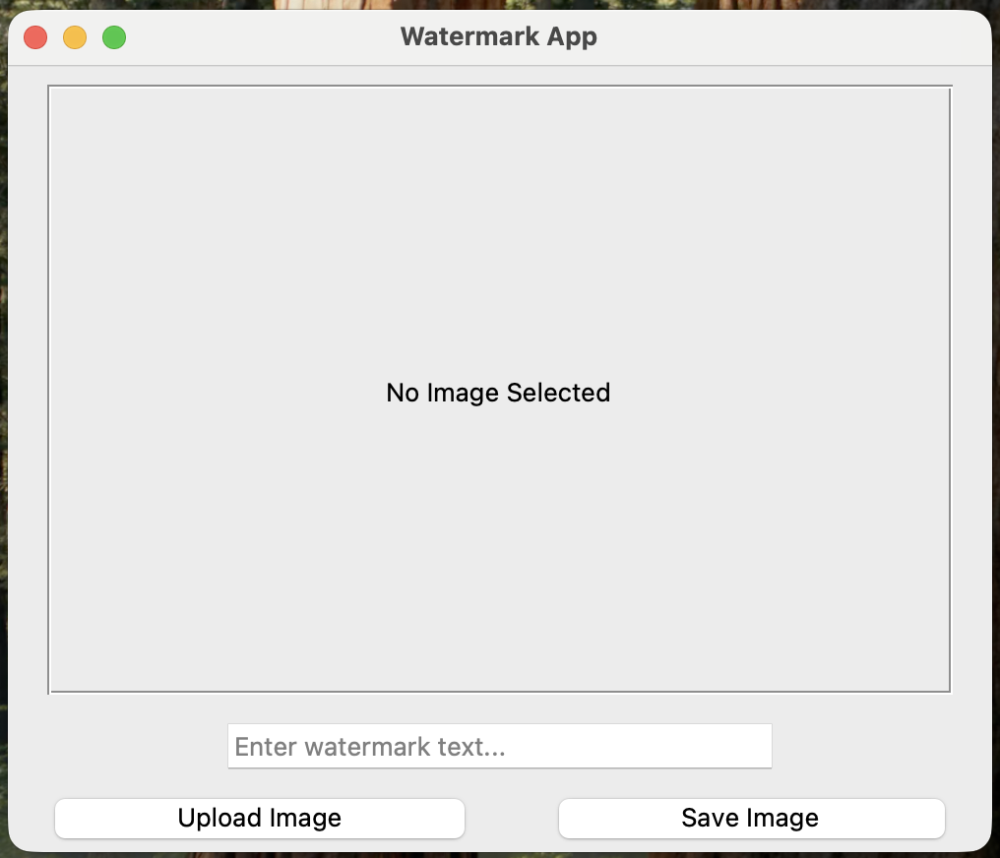
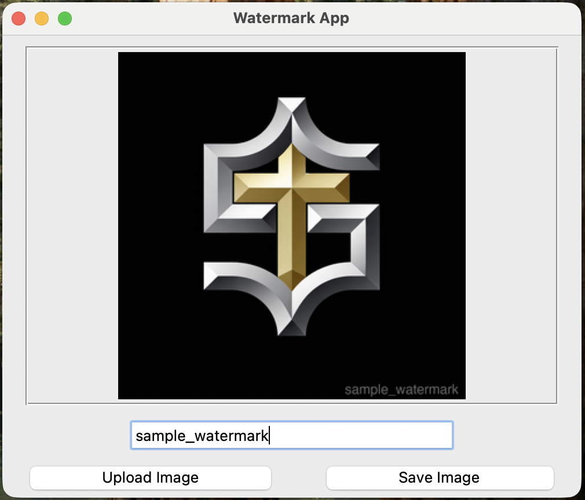
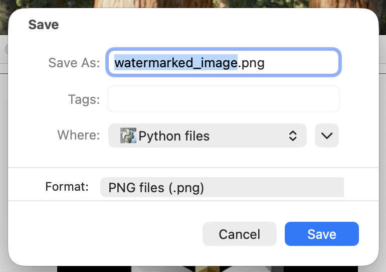

# Watermark Image Desktop App

A desktop application built with Python that allows users to upload images, add watermark text, preview changes in real-time, and save the final image.

## Preview

### App Interface

### Image Uploaded

### Watermark Applied

## Features
- Upload image
- Add watermark text
- Live preview on Enter
- Automatic text wrapping
- Adjustable opacity
- Save image to custom location

## Tech Stack
- Python
- Tkinter
- Pillow (PIL)

## How to Run
1. Install dependencies:
   pip install pillow

2. Run the app:
   python main.py
